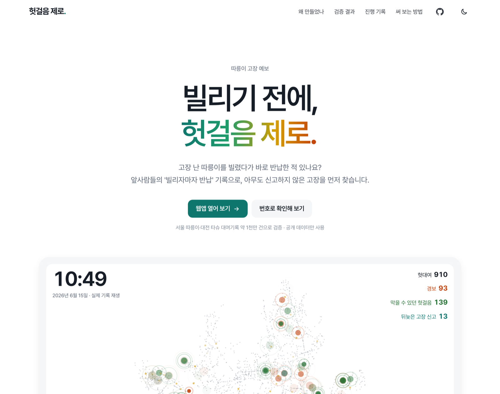
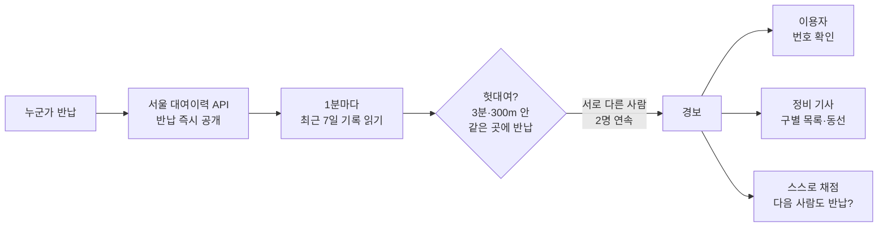
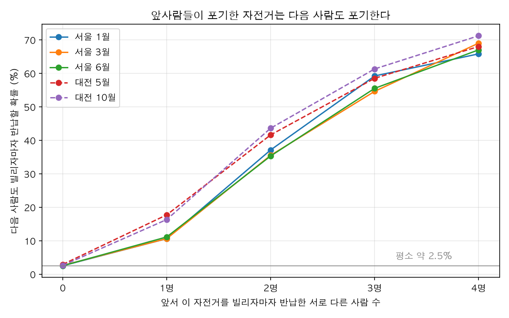
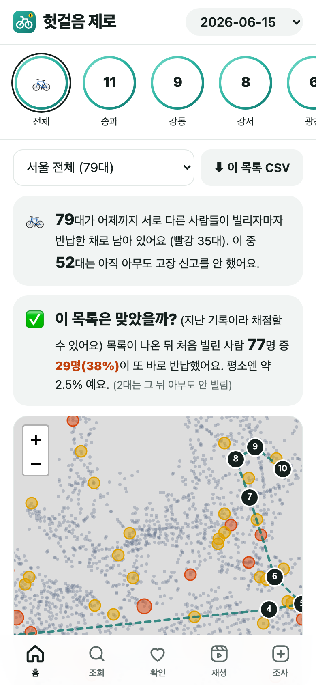
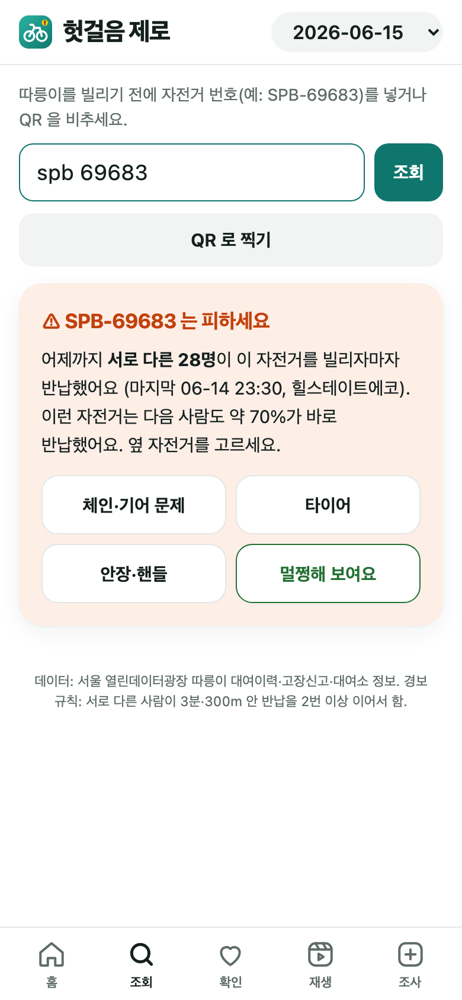
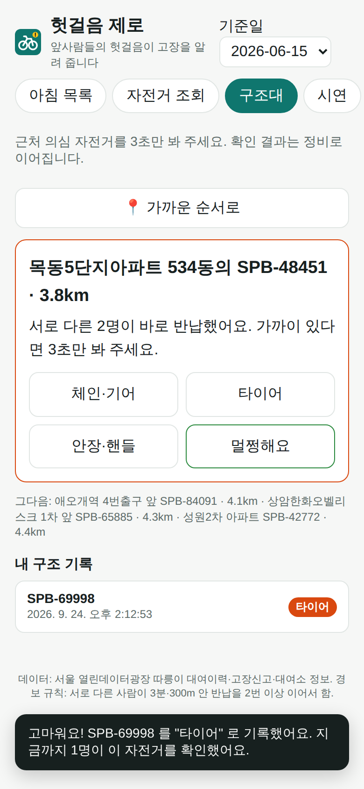
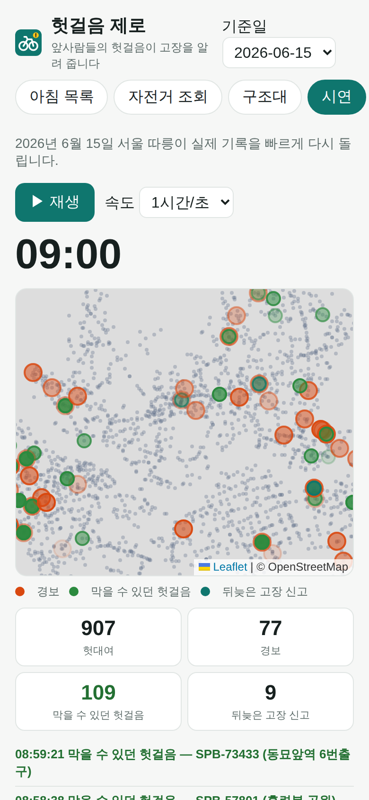

<h1 align="center">헛걸음 제로</h1>

<p align="center"><b>따릉이 고장 예보</b> — 사람들이 귀찮아서 안 하는 고장 신고를,<br>이미 공개된 <b>'빌리자마자 반납'</b> 기록이 대신한다.</p>

<p align="center">
  <a href="https://zmflm0110.github.io/bike-doctor/"></a>
  <a href="https://zmflm0110.github.io/bike-doctor/app/"></a>
  <a href="https://github.com/zmflm0110/bike-doctor/actions/workflows/test.yml"></a>
  <a href="https://github.com/zmflm0110/bike-doctor/actions/workflows/ios.yml"></a>
</p>

<p align="center">
  <a href="https://zmflm0110.github.io/bike-doctor/"></a>
</p>

<p align="center">
  <a href="https://zmflm0110.github.io/bike-doctor/">웹사이트</a> ·
  <a href="https://zmflm0110.github.io/bike-doctor/app/">웹앱 써 보기</a> ·
  <a href="docs/report.pdf">보고서 PDF</a> ·
  <a href="docs/slides.pdf">발표 PDF</a> ·
  <a href="docs/demo/demo.mp4">시연 영상 (1분 32초)</a> ·
  <a href="CHANGELOG.md">진행 기록</a>
</p>

---

## 한눈에

- **서로 다른 두 사람**이 연달아 빌리자마자 반납한 자전거는, 다음 사람도 **35\~44%** 가 바로 반납한다. 평소엔 2.5% — 약 14배.
- 이 경보는 고장 신고보다 **20\~25시간 먼저** 울리고, 끝내 **신고되지 않을 고장(49\~61%)** 까지 찾는다.
- 서울 대여이력 API 는 자전거별 기록을 **반납하자마자** 준다. 그래서 지금 **1분마다 실시간 경보**를 낸다(2026년 9월 25일부터 운영).
- 서울 3개월·대전 2개월, **약 1천만 건**으로 검증했다. 기준은 1월 기록으로만 정하고 다른 달·도시에 그대로 적용했다.

## 왜 만들었나

- **시작한 이유** — 따릉이 고장 신고는 매년 10만 건이 넘는다([헤럴드경제](https://biz.heraldcorp.com/article/10878875)). 그런데 고장 자전거를 만난 사람 대부분은 신고하지 않고, 그 자리에 반납한 뒤 옆 자전거를 빌린다. 신고는 귀찮으니까. 그 자전거는 앱에 '대여 가능' 으로 남아 다음 사람을 기다린다.
- **목적** — 이용자는 **빌리기 전에 피하고**, 정비는 **신고보다 먼저** 고친다.
- **의의** — 사람에게 할 일을 늘리지 않고, 이미 남는 흔적을 읽는다. 새 장비·센서 없이 공개 자료만 쓰므로, 대여기록이 있는 어느 도시에도, 충전기 같은 다른 공유 시설에도 옮길 수 있다.

## 어떻게 작동하나



| 규칙 | 뜻 |
|---|---|
| 헛대여 | 같은 대여소에 **3분** 안에, **300m** 도 안 가고 반납. 타 보려다 포기한 흔적 |
| 서로 다른 사람 | 한 사람이 여러 번 해 본 건 한 번으로 센다(생년·성별이 같으면 같은 사람, 그 자료가 없으면 **반납 2분 안 재대여** = 같은 사람) |
| 경보 | 서로 다른 사람의 헛대여가 **2명** 이어지면 노랑, **3명** 이면 빨강 |
| 끝 | 누군가 정상적으로 타고 가면 연쇄가 끊기고 경보도 꺼진다 |

## 핵심 결과

<p align="center"></p>

| | 결과 | 근거 |
|---|---|---|
| 앞선 포기 2명 → 다음 사람 포기 | 서울 35.3\~37.1%, 대전 41.6\~43.6% (평소 2.5\~2.9%) | [results](docs/results.md) |
| 경보 정밀도 | 경보 한 건마다 다음 다른 사람 기준 **32.1\~34.3%** · 경보가 켜진 동안 빌린 모든 사람 기준 51.8\~60.2% (1월과 ±2.3%p) · 3명 연속이면 약 70% | [phase1](docs/phase1.md) · [per_alarm](docs/per_alarm.md) |
| 신고보다 빠름 | 경보 → 고장 신고 중앙값 **20\~25시간**, 그 사이 한 자전거에서 평균 3.5\~4.6명 헛걸음 | [보고서 5-3](docs/report.md) |
| 신고 안 되는 고장 | 서로 다른 사람의 연속 헛대여 중 **49\~61%** 는 7일이 지나도 신고 없음 | [보고서 5-3](docs/report.md) |
| 막을 수 있던 헛걸음 | 서울 하루 **90\~243명**, 대전 하루 114\~132명 | [보고서 5-2](docs/report.md) |
| 실시간 | API 와 월별 파일을 같은 날(6/15)로 대조: 대여 150,830 / 150,827건, 다음 날 목록 79대 동일 | [api_parity](docs/api_parity.md) |
| 정비 동선 | 근무 시간 안에 가장 많이 막는 동선(오리엔티어링): 시간이 빠듯할 때 순위대로 돌기보다 **9\~18% 더** 막음 (6월 되짚기, 방법은 3월로 고름) | [route_backtest](docs/route_backtest.md) |

## 누구에게 도움이 되나

**고치는 쪽이 먼저 알고, 그 결과로 빌리는 사람의 헛걸음이 줄어든다.** (측정 = 실제 기록으로 잰 것 · 재는 중 · 가능성)

| 누구 | 어떤 도움 | 근거 |
|---|---|---|
| **정비 기사** | 신고보다 20\~25시간 먼저, 끝내 신고되지 않을 고장(49\~61%)까지 — 하루 70\~80대라 감당할 만한 양 | 측정 |
| **정비 동선** | 근무 시간 안에 헛걸음을 가장 많이 막는 순서 — 시간이 빠듯할 때 순위대로 돌기보다 9\~18% 더 | 측정 |
| 서울시설공단 | 새 장비·비용 없이, 이미 가진 대여기록으로 신고에 기대지 않는 고장 현황판 | 가능성 |
| 출근·통학하는 사람 | 고장 자전거가 빨리 치워져 헛걸음이 준다 — 경보가 있었다면 서울 하루 90\~243건. 번호로 직접 확인도 가능 | 측정 |
| 관광객·어르신·처음 타는 사람 | 따로 앱을 깔지 않으므로, **공식 따릉이 앱에 경고가 뜰 때** 가장 도움이 된다 | 가능성 |
| 다른 도시 공공자전거 | 대전 타슈에 서울 기준 그대로 적용해 확인(다음 사람 41.6\~43.6% 포기) | 대전 측정 |
| 전기차 운전자 | 앱엔 '사용 가능' 인데 안 되는 충전기 — 서울 충전기 수집 중. 고장이 아닌 기록(0초 충전 등)을 거른 뒤 3분 안에 끊긴 충전 약 3\~4% ([중간 검증](docs/ev_validation.md)) | 재는 중 |
| 현장 확인(구조대) | 도움을 받는 쪽이라기보다, 경보가 진짜 고장이었는지 사람 눈으로 확인하는 **검증 도구** | 검증 |

> **정비 기사와 구조대의 차이** — 정비 기사는 공단 직원으로 자전거를 실제로 고치거나 수거한다. 구조대는 일반 시민으로, 지나가다 3초 보고 "체인·타이어·안장·브레이크·멀쩡함" 중 하나만 누른다. 구조대가 확인한 곳이 정비 목록 맨 위로 올라가, 기사는 확실한 고장부터 간다.

## 화면

<table>
  <tr>
    <td align="center"><br><b>아침 목록</b><br><sub>지도 · 정비 순위 · 동선</sub></td>
    <td align="center"><br><b>자전거 조회</b><br><sub>번호·QR → 경고</sub></td>
    <td align="center"><br><b>구조대</b><br><sub>3초 확인</sub></td>
    <td align="center"><br><b>시연</b><br><sub>하루 재생</sub></td>
  </tr>
</table>

웹앱(휴대폰에서 홈 화면에 추가)과 아이폰 앱(SwiftUI, [`ios/`](ios/README.md))이 같은 다섯 화면을 가진다.

## 바로 해 보기

인증키 없이, 공개 자료만으로 모든 표를 다시 만든다.

```sh
python3 -m venv .venv && .venv/bin/pip install -r requirements.txt
.venv/bin/python data/download.py          # 원본 자료 (약 1.7GB)
.venv/bin/python analysis/report.py        # 핵심 표 → docs/results.md
.venv/bin/python server/app.py             # 웹앱 → http://localhost:8765
.venv/bin/python -m pytest -q tests        # 테스트 23개
```

<details>
<summary><b>실시간 경보 켜기</b> (서울 열린데이터광장 인증키)</summary>

키는 코드·git 에 넣지 않고 macOS 키체인에 둔다. 아래처럼 `-w` 로 끝내면 키를 화면에 안 보이게 묻는다.

```sh
security add-generic-password -a bike-doctor -s seoul-openapi -w      # 서울 열린데이터광장
security add-generic-password -a bike-doctor -s datagokr -w           # 공공데이터포털 (충전기, 선택)
```
맥이 아닌 서버에서는 환경변수 `SEOUL_OPENAPI_KEY`, `DATAGOKR_KEY`.

```sh
.venv/bin/python server/live.py                     # 지난 7일 채움 → 1분마다 web/data/live.json (앱 '지금 (실시간)')
.venv/bin/python server/live.py --report            # 실시간 경보 채점: 다음 다른 사람도 바로 반납했나
.venv/bin/python server/daily_job.py --source live  # 오늘 아침 목록 + 어제 목록 채점
.venv/bin/python server/schedule.py install --ev    # 맥에서 늘 돌게 (실시간·06:10 아침 목록·웹 서버·충전기 5분)
```
앱은 실시간 파일이 20분 안에 갱신됐으면 '지금 (실시간)' 을, 아니면 최근 목록 → 시연 날짜(6/15) 순으로 먼저 보여 준다.
</details>

<details>
<summary><b>아이폰에서 쓰기</b></summary>

- **웹앱**: 같은 와이파이에서 사파리로 `http://<맥 이름>.local:8765` → 공유 → 홈 화면에 추가.
  위치·QR 카메라는 https 에서만 되므로 `sh server/https_local.sh` 의 안내대로 인증서를 한 번 설치하고 `server/app.py 8443 --https`.
- **아이폰 앱**: 맥에 Xcode → `ios/HeotgeoleumZero.xcodeproj` → Team 고르고 ▶. 자세히는 [`ios/README.md`](ios/README.md).
</details>

<details>
<summary><b>검사와 제출물 다시 만들기</b></summary>

```sh
npm i playwright marked
node tests/web/smoke.js                                                          # 웹앱 다섯 탭 휴대폰 화면 검사
PW_EXPERIMENTAL_SERVICE_WORKER_NETWORK_EVENTS=1 node tests/web/offline.js evict  # 진짜 오프라인 시연 (normal·evict·notiles)
SHOTS=docs/shots node tests/web/smoke.js                                         # 앱 화면 사진
node tests/web/record_demo.js                                                    # 시연 영상 (mp4 는 ffmpeg 필요)
node docs/build_pdf.js                                                           # 보고서·제안서·발표 PDF
.venv/bin/python tools/build_site.py                                             # 웹사이트 자료·진행 기록 쪽
```
GitHub 에 올릴 때마다 `test`(파이썬·웹), `ios`(Swift 엔진·Xcode 빌드·시뮬레이터), `pages`(웹사이트) 가 자동으로 돈다.
</details>

## 폴더

| 폴더 | 내용 |
|---|---|
| [`engine/`](engine) | 헛대여·연쇄·경보 규칙(`core.py`), 아침 목록(`morning.py`), 충전기 헛충전(`ev.py`) |
| [`server/`](server) | 실시간 경보(`live.py`), 매일 아침 목록(`daily_job.py`), 웹 서버(`app.py`), 서울 API, 충전기 수집, 맥 자동 실행 |
| [`analysis/`](analysis) | 검증 스크립트 — 기준 선택, 실시간 가능성, API 대조, 현장 검증, 그림 |
| [`web/`](web) | 웹앱 — 아침 목록·자전거 조회(QR)·구조대·시연·현장 조사, 오프라인 동작 |
| [`ios/`](ios/README.md) | 아이폰 앱(SwiftUI) — 엔진 패키지 `Core/`, 화면 `App/` |
| [`site/`](site) | 작품 소개 웹사이트 (GitHub Pages) |
| [`docs/`](docs/README.md) | 보고서·발표·결과 표·절차 — [문서 목록](docs/README.md) |
| [`tests/`](tests) | 파이썬 테스트 23개, 웹 화면·오프라인 검사 |
| [`data/`](data) | 공개 자료 내려받기(`download.py`) — 원본은 저장소에 넣지 않음 |

## 진행 상황

| 단계 | 상태 |
|---|---|
| 엔진·검증 (서울 3개월·대전 2개월) | ✅ 완료 |
| 실시간 경보 서버 | 🟢 운영 중 (2026-09-25\~) — 7일 연속 운영·실시간 채점 100건 모으는 중 |
| 웹앱 · 아이폰 앱 | ✅ 웹앱 완료 · 🟡 아이폰 앱은 CI 빌드 통과, 실기기 설치 남음 |
| 전기차 충전기로 넓히기 | 🟢 수집 중 — 기록 품질 거르기 완료, 1\~2주 모은 뒤 연쇄 검증 ([중간](docs/ev_validation.md)) |
| 현장 검증 (자전거 150대+ 직접 확인) | ⏳ 준비 완료 — 조사 2주 남음 |
| 대회 제출물 (보고서·발표·영상·웹사이트) | 🟡 초안 완료 — 대회 형식에 맞추기 남음 |

자세한 측정·실패 기록은 [`PLAN.md`](PLAN.md), 바뀐 점은 [`CHANGELOG.md`](CHANGELOG.md).

## 한계

- **"고장" 정답이 없다.** 고장 신고는 늦고 드물어서 다음 사람의 헛걸음을 주 지표로 쓴다. 현장에서 직접 보고 맞춰 보는 조사를 준비했다.
- **아무도 안 빌린 고장은 못 본다.** 연쇄 뒤 이틀 넘게 서 있던 자전거는 이미 수거된 경우가 많아 목록에서 뺀다.
- **고장 종류는 못 맞힌다.** 평균으로는 단말기 고장이 더 빨리 반납되지만, 한 대씩 맞히면 10\~14% 뿐이라 종류는 사람이 확인한다.

## 자료 · 참고

- **자료**: 서울 열린데이터광장 — 따릉이 대여이력([OA-15182](https://data.seoul.go.kr/dataList/OA-15182/F/1/datasetView.do), 실시간 API `tbCycleRentData`), 고장신고([OA-15644](https://data.seoul.go.kr/dataList/OA-15644/F/1/datasetView.do)), 대여소 정보 · 공공데이터포털 — 대전 타슈 대여이력, 한국환경공단 전기차 충전소 정보 (모두 공공누리 제1유형).
  `web/data/` 에는 가공한 결과(자전거 번호·대여소·시각)만 있고 이용자 정보(생년·성별)는 없다. 실시간 서버는 9일 지난 기록을 지운다.
- **참고 연구**: Kaspi·Raviv·Tzur, [Detection of Unusable Bicycles in Bike-Sharing Systems](https://www.researchgate.net/publication/290496984_Detection_of_Unusable_Bicycles_in_Bike-Sharing_Systems) (Omega, 2016) · [Self-Supervised Transformer for Unusable Shared Bike Detection](https://arxiv.org/pdf/2505.00932) (2025).
  이 작품은 한국 공개 자료로 누구나 재현할 수 있고, 같은 사람의 재시도를 걸러 낸 "서로 다른 사람" 연쇄를 쓰며, 근거(앞사람 몇 명이 포기했는지)를 이용자 화면에 그대로 보여 준다.
- **포함한 라이브러리**: [Leaflet](https://leafletjs.com) 1.9.4 (BSD-2), [jsQR](https://github.com/cozmo/jsQR) 1.4.0 (Apache-2.0) — `web/vendor/` 에 라이선스 동봉. 지도 © OpenStreetMap 기여자. 글꼴 [Pretendard](https://github.com/orioncactus/pretendard) (OFL).
